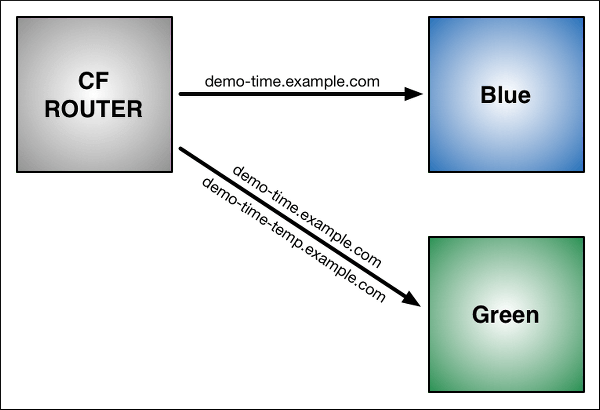

# Blue Green Deployment

## Goal
Demonstrate how to deploy an application with zero downtime on PCF.

## Prerequisites

+ Working PCF Environment
+ Sample App

## Blue-Green Deployment with PCF

1. Use the Cloud Foundry Command Line Interface (cf CLI) to push the application. Name the application “Blue” with the subdomain “demo-time.”

    `$ cf push Blue -n demo-time`

As shown in the graphic below:

Blue is now running on Cloud Foundry.
The CF Router sends all traffic for demo-time.example.com traffic to Blue.


1. Now make a change to the application. First, replace the word “Blue” on the web page with “Green,” then rebuild the source file for the application. Run `cf push` again, but use the name “Green” for the application and provide a different subdomain to create a temporary route:

    `$ cf push Green -n demo-time-temp`

After this push:

Two instances of our application are now running on Cloud Foundry: the original Blue and the updated Green.
The CF Router continues sending all traffic for `demo-time.example.com` to Blue. The router now also sends any traffic for `demo-time-temp.example.com` to Green.


1. Now that both apps are up and running, switch the router so all incoming requests go to the Green app and the Blue app. Do this by mapping the original URL route (demo-time.example.com) to the Green application using the `cf map-route` command.

    ```
    $ cf map route Green example.com -n demo-time
    Binding demo-time.example.com to Green... OK
    ```

After the `cf map-route` command :

+ The CF Router continues sending traffic for demo-time-temp.example.com to Green.

+ Within a few seconds, the CF Router begins load balancing traffic for demo-time.example.com between Blue and Green.



1. Once you verify Green is running as expected, stop routing requests to Blue using the `cf unmap-route` command:

    ```
    $ cf unmap-route Blue example.com -n demo-time
    Unbinding demo-time.example.com from blue... OK
    ```

After `cf unmap-route` command:

The CF Router stops sending traffic to Blue. Now all traffic for `demo-time.example.com` is sent to Green:


1. You can now use `cf unmap-route` to remove the route `demo-time-temp.example.com` from Green. The route can be deleted using `cf delete-route` or reserved for later use. You can also decommission Blue, or keep it in case you need to roll back your changes.


## Blue-Green Deploy Sample App

1. We will use a plugin for the CF CLI tool to automate a blue-green deployment.  Let's start by getting the plugin from the `CF-Community` repository:

    ```
    $ cf add-plugin-repo CF-Community https://plugins.cloudfoundry.org
    $ cf install-plugin blue-green-deploy -r CF-Community
    ```

1. Navigate to the `starter-app` home directory:

    `$ cd starter-app`

1. Use the plugin to perform a blue-green deploy:

    `$ cf blue-green-deploy sample-app`

1. Notice as the plugin creates a new version of the application called `sample-app-new`.  Now you can create your own blue-green deployments on your mission critical workloads!