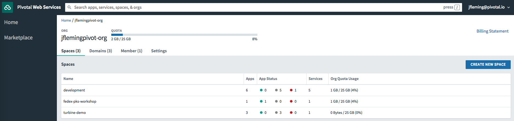

# PCF Metrics

## Goal
Demonstrate capabilities of PCF Metrics.

## Prerequisites

+ Working PCF Environment

## PCF Runtime

1. In your browser, navigate to `https://run.pivotal.io`

2. Log in with the credentials provided by your facilitator.

3. From the `Home` screen choose your `Org`.

4. Once you have selected an `Org`, you will see a list of `Spaces`.  Each `Space` contains multiple `Apps`, `Services` and `Routes`.  Select your `Space` from the list.

5. Click on the `sample-app` app in the list.  To the right of the screen you will see a link titled `View in PCF Metrics`.  Click that link to open the window.

# Metrics

1. On the main screen you can view metrics for 7 components:

    + Average Request Latency
    + Requests per Minute
    + Request Errors per Minute
    + CPU Usage
    + Disk
    + Memory
    + App Events

1. By clicking the arrow button in the top right of the screen you can switch to a real time streaming view.  Click the button to switch perspectives.

3. Press the button again to switch back to `Static` view.  By adjusting the slider you can modify the date range.  Select the slider and pull it to the left to broaden the data range.

# Logs

1. At the bottom of the PCF Metrics homepage there is a tab labled `Logs`.  Click the tab to expand the box.

1. In this view you can see two weeks history of application logs.  From this view you can:

    + Download log files
    + Search logs by keyword
    + Highlight keywords

