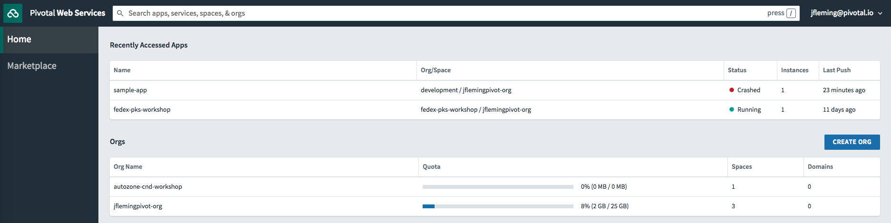

# PCF Overview

## Goal
Overview of PCF environment and components.

## Prerequisites

+ Working PCF Environment

## PCF Runtime

1. In your browser, navigate to `https://run.pivotal.io`

1. Log in with the credentials provided by your facilitator.

1. From the `Home` screen choose your `Org`.

1. Once selecting an `Org`, you will see a list of `Spaces`.  Each `Space` contains multiple `Apps`, `Services` and `Routes`.

1. Create a new `Space` by selecting the `Create New Space` button.  Let's call it `az-workshop`.

1. Next, let's navigate to the `Marketplace` tab on the left of the screen.

1. Here you will see a list of services that are available on-demand to application developers.  We will create some of these services later in the workshop.

1. Click on a deployed application.  On the `Overview` screen you can see the `Scale` and `Autoscale` capabilities.

1. Click on the `Route` tab.  Here you can manage domain routes to your application.

1. Click on the `Logs` tab.  Here you can see a real time stream of application logs.

1. Click on the `Trace` tab.  Here you can see a list of service requests.
